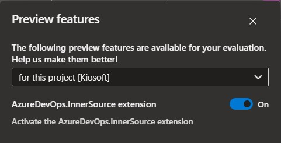

[](https://github.com/dizco/AzureDevOps.InnerSource/pkgs/container/azuredevops.innersource)  [](https://makeapullrequest.com)

# AzureDevOps.InnerSource :star2:

Discoverability of [InnerSource](https://innersourcecommons.org/) repositories on Azure DevOps suffers from a few limitations compared to Github. For example, it is very difficult to find and to assess how mature a repository is. This project provides the following features:
- Aggregated view of all repositories within a project
- Badge to display the last commit date in a repository
- Badge to display the main programming language used in a repository
- Ability to "star" any Azure DevOps repository within an organization and display the number of stars with a badge

## Demo


## How this works
This works in 2 parts. First, an Azure DevOps Extension adds some features in the Azure DevOps organization. Second, the extension communicates with the deployed server. Right now, there is no hosted server offered, you must deploy it yourself. Keep reading for more instructions.

## Getting started
1. Install the [AzureDevOps InnerSource extension](https://marketplace.visualstudio.com/items?itemName=gabrielbourgault.azuredevops-innersource) from the Visual Studio Marketplace.
1. [Activate the feature flag](https://learn.microsoft.com/en-us/azure/devops/project/navigation/preview-features?view=azure-devops#enable-features-at-the-organization-level) on the desired project

   

1. Deploy the server, see [server readme](./server/README.md).
1. Under the "Repos" hub group, you should now see a hub called "All repositories". Click on it.
1. Click on the "Settings" button and set the server url (or navigate directly to `https://dev.azure.com/<your organization>/_settings/gabrielbourgault.azuredevops-innersource.extension-settings-hub`)
1. Edit readmes of all repositories you wish to aggregate with:
   ```html
   <p id="description">TODO: Give a short introduction of your project. Let this section explain the objectives or the motivation behind this project.</p>
   ```
   ```html
   <pre id="packageInstallation"><code>npm install --save potato</code></pre>
   ```
1. Go back to the "All repositories" hub to view the aggregated repositories

### Extension

View the [extension readme](./extension/README.md).

### Server

View the [server readme](./server/README.md).

## Breaking changes
At this time, there is no guarantee on the stability of this template. Breaking changes may occur at any time.

## Known issues
- The code coverage is very low right now
- There is a lot of boilerplate code for MVC that could be removed
- Security has been given some consideration, but would require further assessments
- Concurrent requests are not properly handled, the total star count could be wrong if 2 requests are made in parallel

## Contibuting
- Star this GitHub repo :star: (ironic, isn't it :wink:)
- Create pull requests, submit bugs, suggest new features or documentation updates :wrench:. See [contributing doc](CONTRIBUTING.md).

## License

BSD 3-Clause © [Gabriel Bourgault](https://github.com/dizco)

See [license](LICENSE).