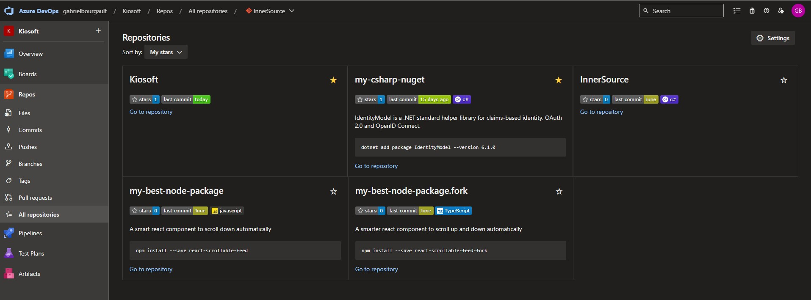
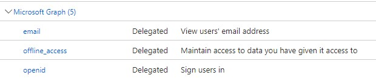

[//]: # (TODO: Add pipeline badge)
[](https://github.com/dizco/AzureDevOps.Stars/actions/workflows/main.yml) [](https://makeapullrequest.com)

 [](https://dotnet.microsoft.com/)

# AzureDevOps.Stars :star2:

Discoverability of [InnerSource](https://innersourcecommons.org/) repositories on Azure DevOps suffers from a few limitations compared to Github. For example, it is very difficult to assess how mature and easy to use a repository is. This template provides the ability to star any Azure DevOps repository within an organization and display the number of stars with a badge.

## Demo


## How this works
The server exposes an endpoint `/stars?project=<project name>&repository=<repository name>`. Within the readme of the desired repository, add a button that links to that endpoint. Upon clicking the button, the user gets redirected to Azure AD for authentication, after which his _star_ is recorded in the database.

## Getting started
1. [Install .NET 7 SDK](https://dotnet.microsoft.com/en-us/download/dotnet/7.0), if not already installed.
1. Clone this repository
   ```
   git clone https://github.com/dizco/AzureDevOps.Stars.git
   ```
1. In Azure AD, create a new `App registration`
   1. Set redirect URI `https://localhost:44400/signin-oidc`
   1. Set API Permissions `openid` and `email`

      
   
   1. Create a client secret
   1. Take note of the tenant ID, client ID and client secret

1. Create a new Azure Storage Account
   1. Create a new Table `azuredevopsstars`

1. With Visual Studio, open the `AzureDevOps.Stars.sln`
1. Update the `appsettings.json` and `appsettings.Local.json` files
   
   | Config | Value |
   |---|---|
   | `IdentityProvider:Authority` | `https://login.microsoftonline.com/<your tenant id>/v2.0/` |
   | `IdentityProvider:ClientId` | `<your client id>` |
   | `IdentityProvider:ClientSecret` | `<your client secret>` |
   | `Storage:TableStorageConnectionString` | `<your azure storage connection string>` |
   | `DevOps:Organization` | `<your Azure DevOps organization name>` |
   | `DevOps:StarsAllowedRepositories` | <code>[<br/>&nbsp;{<br/>&nbsp;&nbsp;"RegexProject": "\<your project name or regex>",<br/>&nbsp;&nbsp;"RegexRepository": "\<your repository name or regex>"<br/>&nbsp;}<br/>]</code> |
   
1. Press F5
1. Edit the readme of the desired repository with:
   ```md
   [Star this repo!](https://localhost:44400/star?project=<project name>&repository=<repository name>)
   
   ```
   Alternatively, you may add the button directely on the badge with:
   ```md
   [](https://localhost:44400/star?project=<project name>&repository=<repository name>)
   ```

## Deploying
No guidance is provided on how and where to host this .NET service.

## Breaking changes
At this time, there is no guarantee on the stability of this template. Breaking changes may occur at any time.

## Known issues
- The code coverage is 0% right now
- There is a lot of boilerplate code for MVC that could be removed
- Security has not been given a proper assessment
- Concurrent requests are not properly handled, the total star count could be wrong if 2 requests are made in parallel

## Contibuting
- Star this GitHub repo :star: (ironic, isn't it :wink:)
- Create pull requests, submit bugs, suggest new features or documentation updates :wrench:. See [contributing doc](CONTRIBUTING.md).

## License

© [Gabriel Bourgault](https://github.com/dizco)