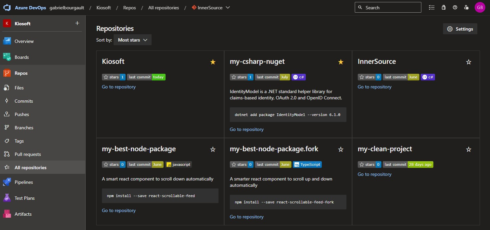

[](https://github.com/dizco/AzureDevOps.InnerSource/actions/workflows/main.yml)  [](https://dotnet.microsoft.com/) [](https://makeapullrequest.com)

# AzureDevOps.InnerSource :star2:

Discoverability of [InnerSource](https://innersourcecommons.org/) repositories on Azure DevOps suffers from a few limitations compared to Github. For example, it is very difficult to find and to assess how mature a repository is. This template provides the following features:
- Ability to generate an aggregation of all repositories
- Badge to display the last commit date in a repository
- Ability to star any Azure DevOps repository within an organization and display the number of stars with a badge

## Demo


## How this works
This works in 2 parts. First, an automated pipeline generates a table in the readme by scraping and aggregating all the available repositories periodically. Secondly, the server exposes API endpoints to interact with stars and badges. Upon clicking the star button, the user gets redirected to Azure AD for authentication, after which his _star_ is recorded in the database.

## Getting started
1. [Install .NET 7 SDK](https://dotnet.microsoft.com/en-us/download/dotnet/7.0), if not already installed.
1. Clone this repository
   ```
   git clone https://github.com/dizco/AzureDevOps.InnerSource.git
   ```
1. In Azure AD, create a new `App registration`
   1. Set redirect URI `https://localhost:44400/signin-oidc`
   1. Set API Permissions `openid`, `profile` and `email`

      
   
   1. Create a client secret
   1. Take note of the tenant ID, client ID and client secret

1. Create a new Azure Storage Account
   1. Create a new Table `azuredevopsstars`

1. With Visual Studio, open the `AzureDevOps.InnerSource.sln`
1. Update the `appsettings.json` and `appsettings.Local.json` files according to your needs.
1. Run with Visual Studio by pressing F5 or with command line with:
   ```shell
   dotnet run --project ./src/AzureDevOps.InnerSource/
   ```
1. Edit the readme of the desired repository with:
   ```md
   [Star this repo!](https://localhost:44400/star?project=<project name>&repository=<repository name>)
   
   ```
   Alternatively, you may add the button directely on the badge with:
   ```md
   [](https://localhost:44400/star?project=<project name>&repository=<repository name>)
   ```

### Repository aggregation
1. Edit readmes of all repositories you wish to aggregate with:
   ```html
   <p id="description">TODO: Give a short introduction of your project. Let this section explain the objectives or the motivation behind this project.</p>
   ```
   ```html
   <pre id="packageInstallation"><code>npm install --save potato</code></pre>
   ```
1. Run aggregation
   ```shell
   dotnet run --project .\src\AzureDevOps.InnerSource\ aggregate --output-folder ./
   ```

## Deploying
A working dockerfile is provided:
```
docker pull ghcr.io/dizco/azuredevops.innersource:latest
```

For further guidance on how to deploy this service, see [deployment guide](docs/deploy.md).

## Breaking changes
At this time, there is no guarantee on the stability of this template. Breaking changes may occur at any time.

## Known issues
- The code coverage is 0% right now
- There is a lot of boilerplate code for MVC that could be removed
- Security has not been given a proper assessment
   - Especially, there are risks of leaking private repositories existence and last commit date. This risk could potentially be mitigated by the use of unique api tokens per repository, which could be added in the link to the badge and validated by the server
- Concurrent requests are not properly handled, the total star count could be wrong if 2 requests are made in parallel

## Contibuting
- Star this GitHub repo :star: (ironic, isn't it :wink:)
- Create pull requests, submit bugs, suggest new features or documentation updates :wrench:. See [contributing doc](CONTRIBUTING.md).

## License

BSD 3-Clause © [Gabriel Bourgault](https://github.com/dizco)

See [license](LICENSE).