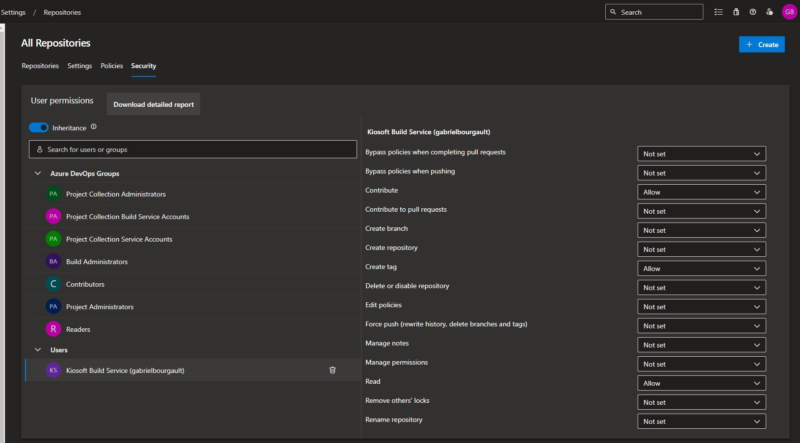

# Deploy

The project is packaged in a ready-to-use docker image. The image can be referenced as-is. The following guide describes how to host this image in an Azure Container app. You could also decide to deploy this to Kubernetes with a deployment.

```shell
docker pull ghcr.io/dizco/azuredevops.innersource:latest
```

Run web server:
```shell
docker run --env DevOps__Organization=myorg --env DevOps__PersonalAccessToken=mypat --env RepositoryAggregation__BadgeServerUrl=https://localhost:44400 ghcr.io/dizco/azuredevops.innersource:latest
```

Run aggregation:
```shell
docker run --env DevOps__Organization=myorg --env DevOps__PersonalAccessToken=mypat --env RepositoryAggregation__BadgeServerUrl=https://localhost:44400 -v '$(Build.ArtifactStagingDirectory):/app/results' ghcr.io/dizco/azuredevops.innersource:latest aggregate --output-folder=/app/results
```

## Key properties
The docker image listens on port 44400.

## Create an Azure Container app
Follow this guide to create a container app: https://learn.microsoft.com/en-us/azure/container-apps/quickstart-portal

Make sure to allow ingress traffic from anywhere.

## Continuous deployment

Execute the following steps on your Azure DevOps project.

1. Generate Personal Access Token that has `Code (Read)` and `Analytics (Read)` permissions
1. In the project repositories security settings, give the Build Service user the permission to Contribute
   
1. Create an Azure Resource Manager service connection to the Azure subscription. See: [Manage service connections](https://learn.microsoft.com/en-us/azure/devops/pipelines/library/service-endpoints?view=azure-devops&tabs=yaml)
1. Create a variable template called `innersource`
   | Variable | Description |
   | --- | --- |
   | BadgeServerUrl | Base url of the server |
   | AzureSubscription | Azure service connection name |
   | ResourceGroup | Azure resource group name |
   | ContainerAppName | Azure container app name |
   | DevOpsPersonalAccessToken | Personal Access Token generated previously |
   | IdpAuthority | OpenID Connect identity provider issuer url |
   | IdpClientId | OpenID Connect client id |
   | IdpClientSecret | OpenID Connect client secret |
   | TableStorageConnectionString | Connection string to the Azure Table Storage |
1. In the Readme repository of the Azure DevOps project, add:
   ```html
   <table id="repositoriesAggregation"></table>
   ```
1. Create an Azure Pipeline on the Readme repository of the Azure DevOps project:
```yaml
trigger:
- main

schedules:
- cron: '0 0 * * *'
  displayName: Daily midnight build
  branches:
    include:
    - main

pool:
  vmImage: ubuntu-latest

variables:
- group: innersource
- name: ShouldUpdateReadme
  value: true
- name: ShouldDeploy
  value: true
- name: ImageTag
  value: latest

jobs:
- job: UpdateReadme
  condition: and(succeeded(), eq(variables.ShouldUpdateReadme, true))
  steps:
  - checkout: self
    persistCredentials: true
    fetchDepth: 0
  - script: git checkout $(Build.SourceBranchName)
    displayName: git checkout
  
  - script: >-
      docker run
      --env DevOps__Organization=$(DevOpsOrganization)
      --env DevOps__PersonalAccessToken=$(DevOpsPersonalAccessToken)
      --env RepositoryAggregation__BadgeServerUrl=$(BadgeServerUrl)
      -v '$(Build.ArtifactStagingDirectory):/app/results' 
      ghcr.io/dizco/azuredevops.innersource:$(ImageTag)
      aggregate --output-folder=/app/results
    displayName: aggregate repositories

  - script: cat $(Build.ArtifactStagingDirectory)/result.md
    displayName: cat result

  # Optional step
  - script: |
      mkdir -p "$(Build.SourcesDirectory)/history/$(Build.BuildNumber)"
      cp $(Build.ArtifactStagingDirectory)/result.md $(Build.SourcesDirectory)/history/$(Build.BuildNumber)/repositories.md
    displayName: copy result file to history

  - pwsh: |
      $readme = Get-Content README.md -Raw
      $replacement = Get-Content $(Build.ArtifactStagingDirectory)/result.md -Raw
      $updatedReadme = $readme -replace '<table id="repositoriesAggregation"(\n|.)*<\/table>', $replacement

      $updatedReadme | Out-File README.md
      Write-Host $updatedReadme
    displayName: update readme

  - script: |
      git config --global user.email "pipeline@example.com"
      git config --global user.name "Azure Pipelines"
      git add .
      git commit -m "[skip ci] Update repositories"
      git push
    displayName: commit new readme

- job: Deploy
  condition: and(succeeded(), eq(variables.ShouldDeploy, true))
  steps:
  - task: AzureCLI@2
    inputs:
      azureSubscription: $(AzureSubscription)
      scriptType: 'pscore'
      scriptLocation: 'inlineScript'
      inlineScript: |
        az containerapp secret set -n $(ContainerAppName) -g $(ResourceGroup) --secrets `
          devopspat=$(DevOpsPersonalAccessToken) `
          idpclientsecret=$(IdpClientSecret) `
          tableconnstring="$(TableStorageConnectionString)"

        az containerapp update -n $(ContainerAppName) -g $(ResourceGroup) --set-env-vars `
          IdentityProvider__Authority=$(IdpAuthority) `
          IdentityProvider__ClientId=$(IdpClientId) `
          IdentityProvider__ClientSecret=secretref:idpclientsecret `
          DevOps__PersonalAccessToken=secretref:devopspat `
          DevOps__Organization=$(DevOpsOrganization) `
          Storage__Mode=TableStorage `
          Storage__TableStorageConnectionString=secretref:tableconnstring `
          ASPNETCORE_FORWARDEDHEADERS_ENABLED=true

    displayName: set app secrets and environment variables
  
  - task: AzureContainerApps@1
    inputs:
      azureSubscription: $(AzureSubscription)
      containerAppName: $(ContainerAppName)
      resourceGroup: $(ResourceGroup)
      imageToDeploy: 'ghcr.io/dizco/azuredevops.innersource:$(ImageTag)'
    displayName: deploy azure container app
```

### References

https://stackoverflow.com/a/75886301/6316091

https://learn.microsoft.com/en-us/azure/container-apps/azure-pipelines