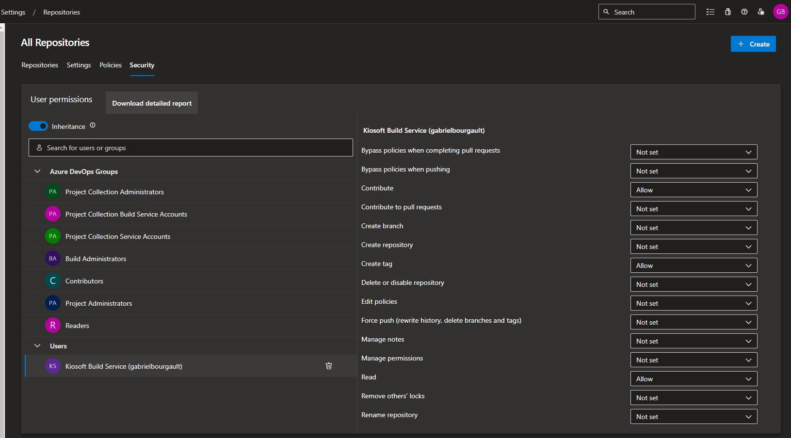

# Deploy

The project is packaged in a ready-to-use docker image. The image can be referenced as-is. The following guide describes how to host this image in an Azure Container app. You could also decide to deploy this to Kubernetes with a deployment.

```shell
docker pull ghcr.io/dizco/azuredevops.innersource:latest
```

## Key properties
The docker image listens on port 44400.

## Create Azure resources
1. Create a new Azure Storage Account
   1. Create a new Table `azuredevopsstars`
1. Create a new Azure Application Insights
1. Create an Azure Container app by following [this guide](https://learn.microsoft.com/en-us/azure/container-apps/quickstart-portal). Make sure to allow ingress traffic from anywhere.

## Continuous deployment

Execute the following steps on your Azure DevOps project.

1. Generate Personal Access Token that has `Code (Read)` and `Analytics (Read)` permissions

1. Create an Azure Resource Manager service connection to the Azure subscription. See: [Manage service connections](https://learn.microsoft.com/en-us/azure/devops/pipelines/library/service-endpoints?view=azure-devops&tabs=yaml)
1. Create a variable template called `innersource`
   | Variable | Description |
   | --- | --- |
   | ServerUrl | Base url of the server |
   | AzureSubscription | Azure service connection name |
   | ResourceGroup | Azure resource group name |
   | ContainerAppName | Azure container app name |
   | DevOpsPersonalAccessToken | Personal Access Token generated previously |
   | TableStorageConnectionString | Connection string to the Azure Table Storage |
   | ApplicationInsightsConnectionString | Connection string to the Application Insights |
   | AuthenticationKey | Symmetric token signing key, essentially any long random string |
   | AzureDevOpsExtensionCertificate | The certificate of the published extension |

1. Create an Azure Pipeline like the [sample pipeline](/.pipelines/azure-pipeline-server.yaml)

## Aggregate in a repo readme

AzureDevOps project wikis can be configured to feed from a Git repository. The following sample explains how to configure a pipeline to automatically update a readme with repositories aggregation.

1. In the project repositories security settings, give the Build Service user the permission to Contribute (see https://stackoverflow.com/a/75886301/6316091)

   

1. In the Readme repository of the Azure DevOps project, add:
   ```html
   <table id="repositoriesAggregation"></table>
   ```
1. Create an Azure Pipeline on the Readme repository of the Azure DevOps project:
```yaml
parameters:
- name: imageTag
  type: string
  default: latest

trigger:
- main

schedules:
- cron: '0 0 * * *'
  displayName: Daily midnight build
  branches:
    include:
    - main

pool:
  vmImage: ubuntu-latest

variables:
- group: innersource
- name: ShouldUpdateReadme
  value: true
- name: ShouldDeploy
  value: true
- name: ImageTag
  value: ${{ parameters.imageTag }}

jobs:
- job: UpdateReadme
  condition: and(succeeded(), eq(variables.ShouldUpdateReadme, true))
  steps:
  - checkout: self
    persistCredentials: true
    fetchDepth: 0
  - script: git checkout $(Build.SourceBranchName)
    displayName: git checkout
  
  - script: >-
      docker run
      --env Authentication__Key=$(AuthenticationKey)
      --env Authentication__Issuer=$(ServerUrl)
      --env Authentication__Audience=$(ServerUrl)
      --env DevOps__Organization=$(DevOpsOrganization)
      --env DevOps__PersonalAccessToken=$(DevOpsPersonalAccessToken)
      --env RepositoryAggregation__BadgeServerUrl=$(ServerUrl)
      -v '$(Build.ArtifactStagingDirectory):/app/results' 
      ghcr.io/dizco/azuredevops.innersource:$(ImageTag)
      aggregate --output-folder=/app/results
    displayName: aggregate repositories

  - script: cat $(Build.ArtifactStagingDirectory)/result.md
    displayName: cat result

  # Optional step
  - script: |
      mkdir -p "$(Build.SourcesDirectory)/history/$(Build.BuildNumber)"
      cp $(Build.ArtifactStagingDirectory)/result.md $(Build.SourcesDirectory)/history/$(Build.BuildNumber)/repositories.md
    displayName: copy result file to history

  - pwsh: |
      $readme = Get-Content README.md -Raw
      $replacement = Get-Content $(Build.ArtifactStagingDirectory)/result.md -Raw
      $updatedReadme = $readme -replace '<table id="repositoriesAggregation"(\n|.)*<\/table>', $replacement

      $updatedReadme | Out-File README.md
      Write-Host $updatedReadme
    displayName: update readme

  - script: |
      git config --global user.email "pipeline@example.com"
      git config --global user.name "Azure Pipelines"
      git add .
      git commit -m "[skip ci] Update repositories"
      git push
    displayName: commit new readme
```

## References

https://learn.microsoft.com/en-us/azure/container-apps/azure-pipelines